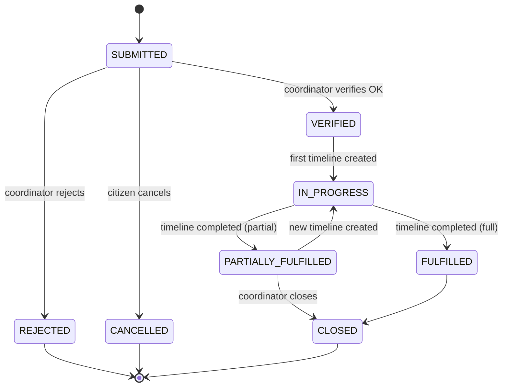
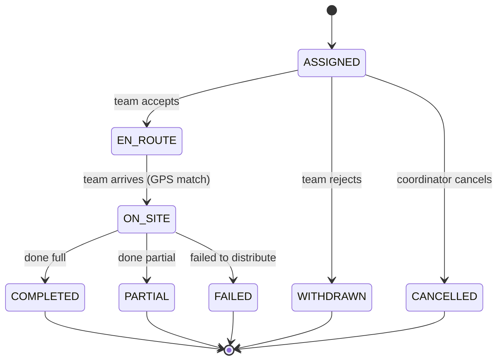
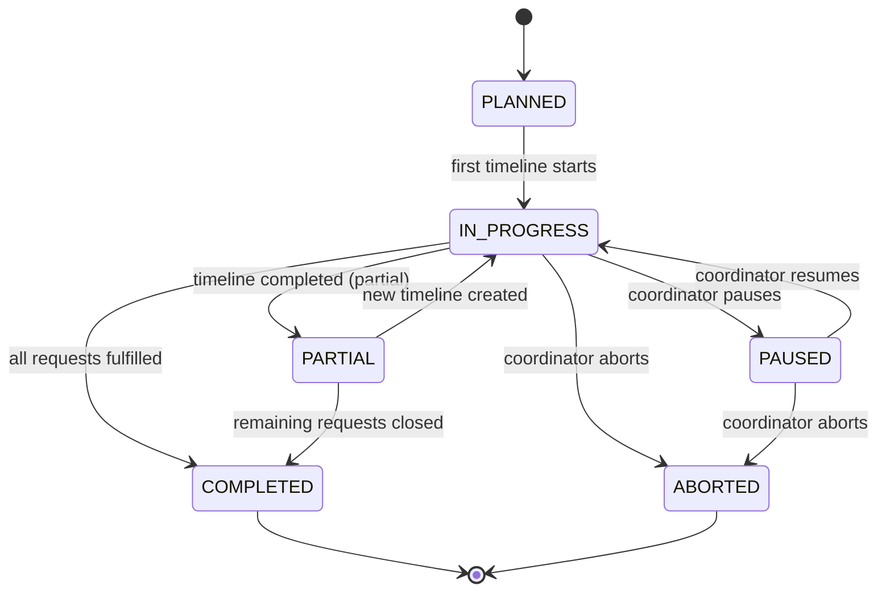
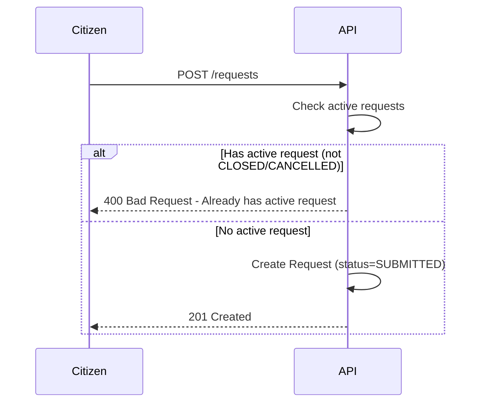
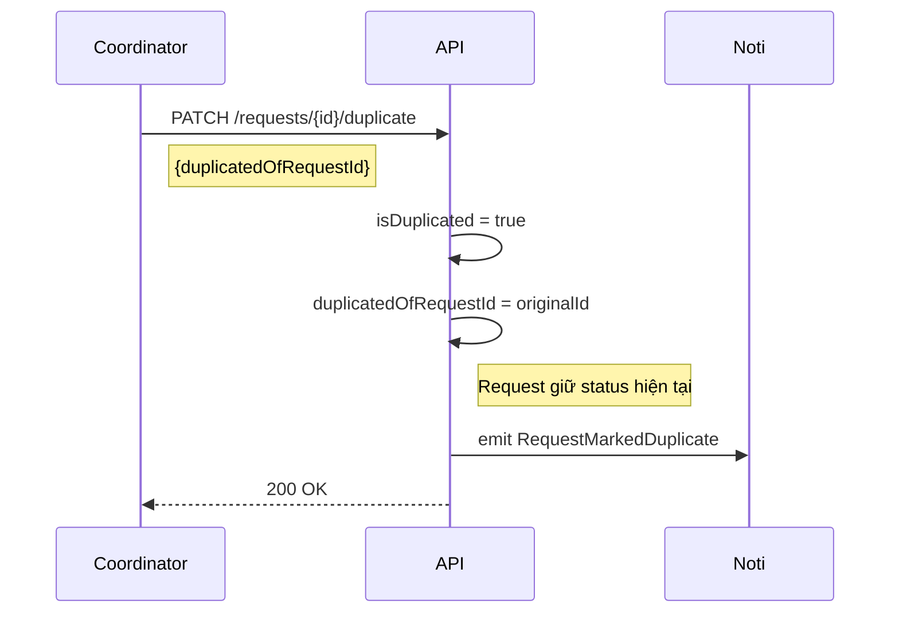
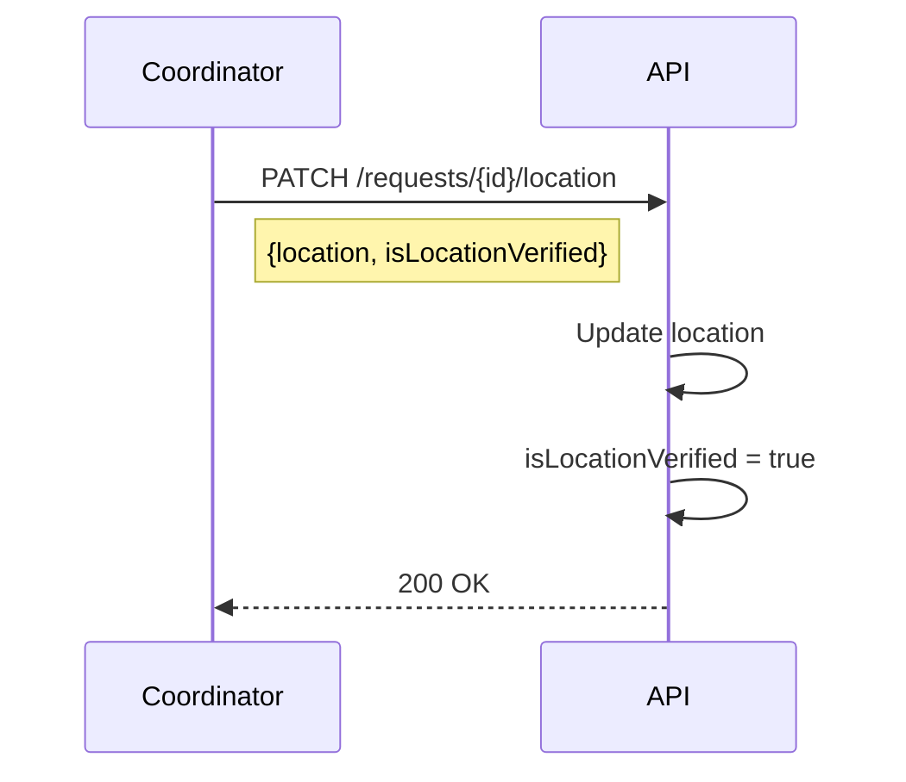

# Relief Flow 1.1 (Unified)

> Phiên bản Unified từ [Relief_flow_1.0.md](./Relief_flow_1.0.md)
>
> **Changes v1.1**:
>
> - Đồng bộ với [rules.md](./rules.md).
> - Thêm **GPS Tracking** (`EN_ROUTE`, `ON_SITE`) giống Rescue Flow.
> - Timeline khởi tạo là `ASSIGNED`.

---

## 1. Request State Diagram (Unified)

### 1.1 Request States Definitions

| State                 | Ý nghĩa                     |
| :-------------------- | :-------------------------- |
| `SUBMITTED`           | Yêu cầu được gửi            |
| `VERIFIED`            | Đã xác minh (Verified OK)   |
| `REJECTED`            | Không hợp lệ                |
| `IN_PROGRESS`         | Có ≥1 timeline đang chạy    |
| `PARTIALLY_FULFILLED` | Đã phát 1 phần / Cứu 1 phần |
| `FULFILLED`           | Đã phát đủ / Cứu đủ         |
| `CLOSED`              | Đóng request (Final)        |
| `CANCELLED`           | Bị huỷ                      |

### 1.2 Request State Diagram

---

## 2. Timeline State Diagram (Unified Core + Tracking)

### 2.1 Timeline States Definitions

| State       | Ý nghĩa                                  |
| :---------- | :--------------------------------------- |
| `ASSIGNED`  | Đã gán team (chờ accept)                 |
| `EN_ROUTE`  | Team đang đi (GPS Tracking)              |
| `ON_SITE`   | Team đã đến điểm cứu trợ và đang phát đồ |
| `COMPLETED` | Phát xong (Đủ hàng)                      |
| `PARTIAL`   | Phát xong (Thiếu hàng)                   |
| `FAILED`    | Không thể tiếp cận / Hỏng xe             |
| `WITHDRAWN` | Team từ chối nhiệm vụ                    |
| `CANCELLED` | Bị huỷ                                   |

### 2.2 Timeline State Diagram

---

## 3. Mission State Diagram (Unified)

### 3.1 Mission States Definitions

| State         | Ý nghĩa                                 |
| :------------ | :-------------------------------------- |
| `PLANNED`     | Đã tạo mission                          |
| `IN_PROGRESS` | Có timeline đang chạy                   |
| `PAUSED`      | Tạm dừng                                |
| `PARTIAL`     | Hoàn thành một phần (cần thêm timeline) |
| `COMPLETED`   | Hoàn tất toàn bộ requests               |
| `ABORTED`     | Huỷ mission                             |

### 3.2 Mission State Diagram

---

## 4. Derived Rules Summary

- **Request = FULFILLED** khi `Sum(Timeline.supplied_amount) >= Request.need_amount`.
- **Request = PARTIALLY_FULFILLED** khi `Sum(...) < Request.need_amount` và hết timeline chạy.
- **Tracking**: Relief Team cũng gửi tọa độ GPS liên tục khi `EN_ROUTE` để Citizen theo dõi.

### Supply Tracking Rules

Relief Flow sử dụng Supply Management giống Rescue Flow:

| Phase            | Timing                   | Action                                 |
| ---------------- | ------------------------ | -------------------------------------- |
| **Planning**     | Coordinator assigns team | Reserve supplies từ Warehouse          |
| **Carrying**     | Team accepts             | Deduct inventory, confirm `carriedQty` |
| **Distribution** | Team completes           | Report `distributedQty`, return unused |

> Chi tiết xem [Supply_management.md](../Supply_management.md)

---

## 5. Request Priority Rules

Khi Coordinator có nhiều Requests cần xử lý cùng lúc, ưu tiên theo thứ tự:

1. **Mức độ khẩn cấp (priority)** - _Coordinator gắn flag thủ công khi verify_
   - `CRITICAL` (High): Nguy hiểm tính mạng ngay lập tức
   - `HIGH` (Medium): Nguy cơ cao, chưa khẩn cấp tức thì
   - `NORMAL` (Low): Hỗ trợ khi có điều kiện

2. **Số người bị ảnh hưởng (peopleCount)**
   - Ưu tiên request có nhiều người hơn

3. **Thời gian tạo yêu cầu (createdAt)**
   - First-come-first-served nếu priority và peopleCount bằng nhau

---

## 6. Validation & Duplicate Detection

### Request Creation Validation

**Rule:** Một Citizen chỉ được tạo Request mới khi request hiện tại đã ở terminal states (`CLOSED` hoặc `CANCELLED`).

### Duplicate Detection

Coordinator đánh dấu duplicate thủ công. _Future: Hệ thống đề xuất duplicate dựa trên location + time + citizen._

> **Note:** Request được đánh dấu duplicate vẫn được xử lý bình thường và có thể chuyển qua các status như request thông thường, nhưng sẽ được link với request gốc để tracking.

### Location Verification

Coordinator có thể cập nhật location và đánh dấu verified.

---

## 7. API Endpoints Summary

| Method  | Endpoint                   | Actor               | Description                                       |
| :------ | :------------------------- | :------------------ | :------------------------------------------------ |
| `POST`  | `/requests`                | Citizen/Coordinator | Create request (validates 1 active request limit) |
| `PATCH` | `/requests/{id}/verify`    | Coordinator         | Verify request → `VERIFIED` / `REJECTED`          |
| `PATCH` | `/requests/{id}/duplicate` | Coordinator         | Mark as duplicate                                 |
| `PATCH` | `/requests/{id}/location`  | Coordinator         | Update location & verify                          |
| `PATCH` | `/timelines/{id}/complete` | Team                | Report completion → `COMPLETED` / `PARTIAL`       |

---

## 8. References

- [rules.md](./rules.md) - Rules chính thức.
- [Rescue_flow_2.2.md](./Rescue_flow_2.2.md) - Flow cứu hộ tương ứng.
- [Supply_management.md](../Supply_management.md) - Supply tracking 3-phase.

---

## Phase 1 Implementation Notes (2026-02-15)

- Core Timeline lifecycle APIs đã được implement theo Unified v2.2.
- Request/Mission/Team status được derive/sync từ Timeline runtime status.
- Trong Phase 1 chưa tích hợp GPS Position và TimelineSupply cho Relief execution.
