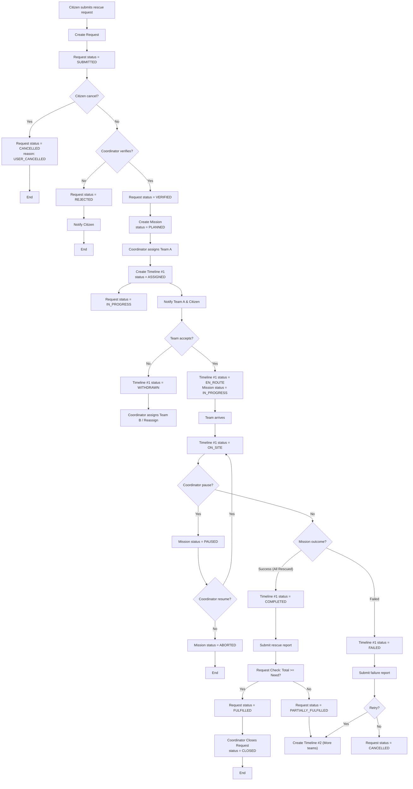
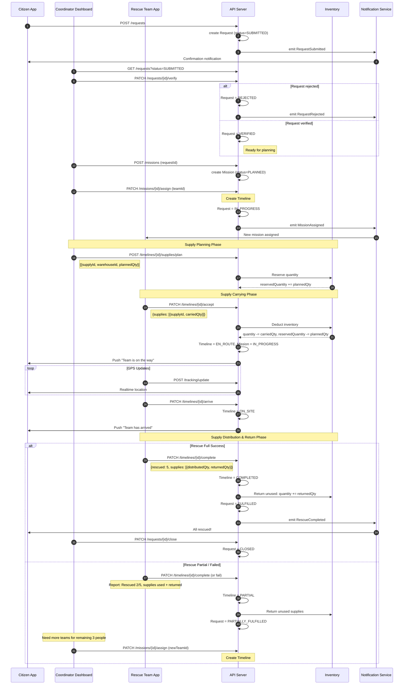
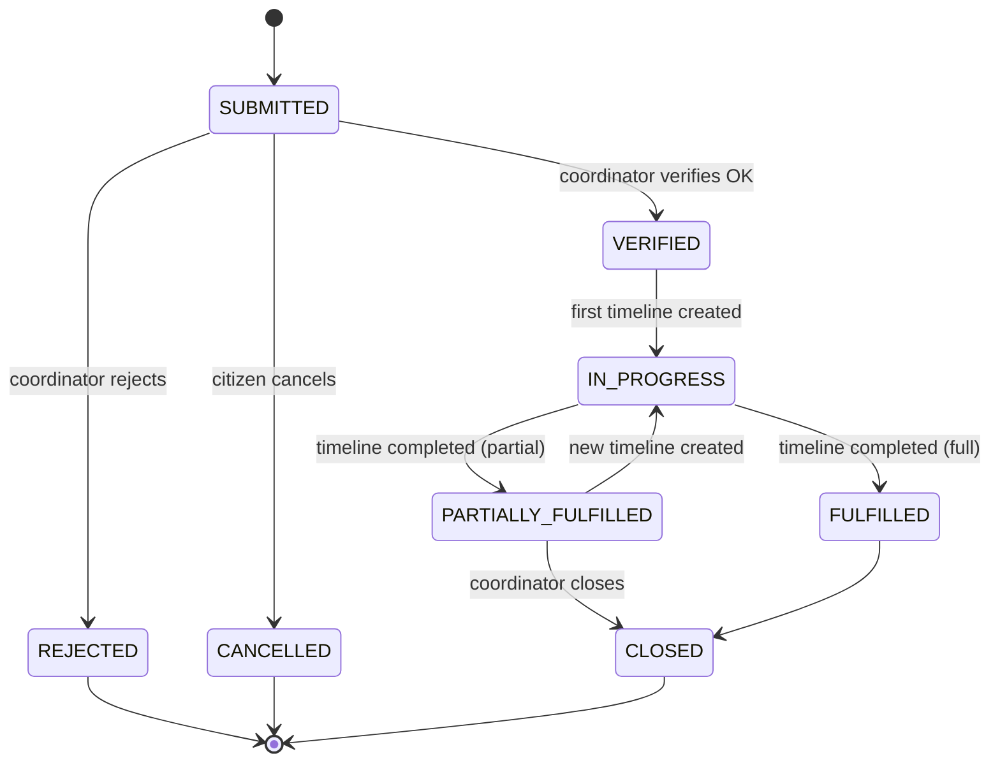
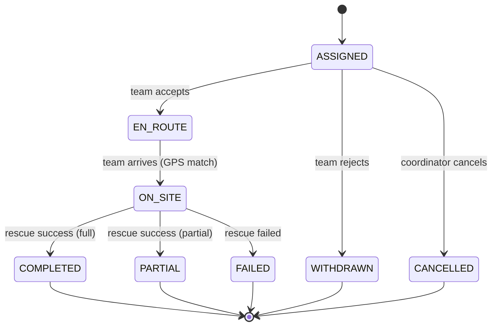
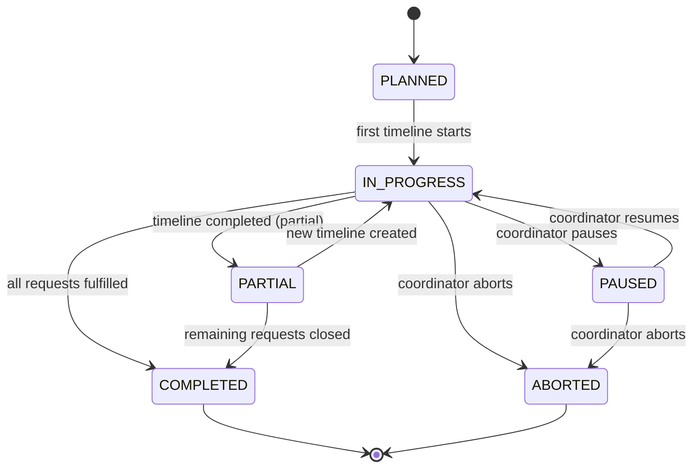
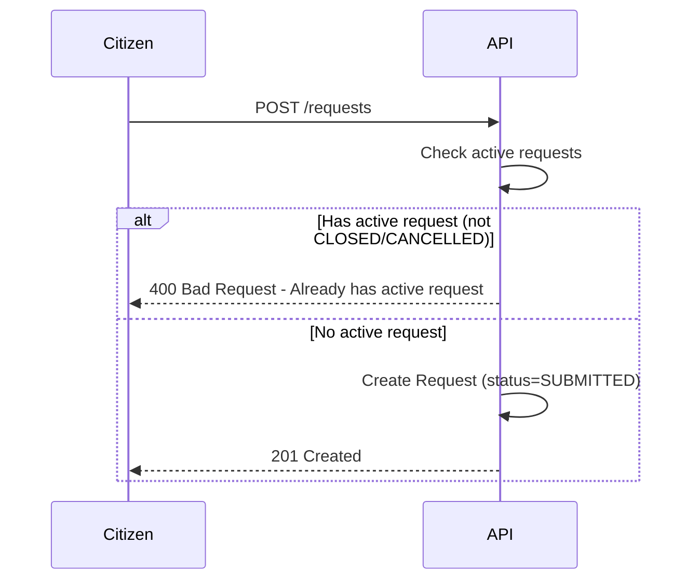
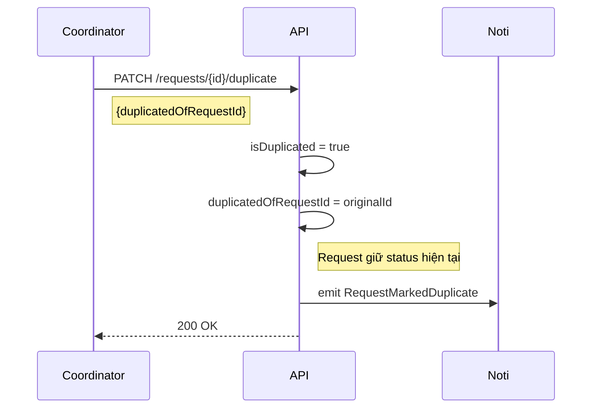
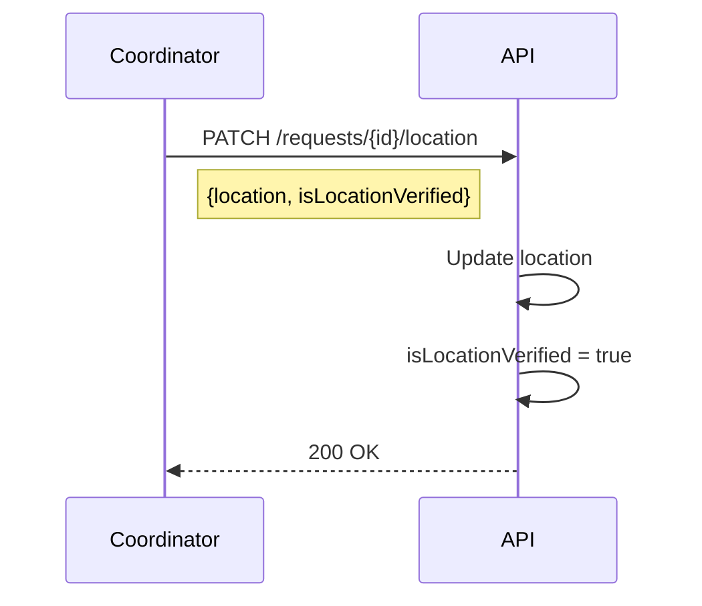

# Rescue Flow 2.2 (Unified)

> Phiên bản Unified từ [Rescue_flow_2.1.md](./Rescue_flow_2.1.md)
>
> **Changes v2.2**:
>
> - Áp dụng Unified States từ [rules.md](./rules.md).
> - Request Status: `ACCEPTED` → `VERIFIED`.
> - Timeline Status: `ASSIGNED` (initial).
> - Hỗ trợ **Multi-timeline**: 1 Request có thể được cứu bởi nhiều Team cùng lúc.

---

## Flowchart for Rescue Flow (Unified)

---

## Sequence Diagram for Rescue Flow (Unified)

---

## State Diagrams (Unified)

### 1. Request State Diagram

### 2. Timeline State Diagram

### 3. Mission State Diagram

---

## Status Definitions

_(Tham chiếu đầy đủ xem tại [rules.md](./rules.md))_

### Request Status (Unified)

| Status                | Meaning                               |
| :-------------------- | :------------------------------------ |
| `VERIFIED`            | Đã xác minh, chờ lên Mission          |
| `IN_PROGRESS`         | Đang có team xử lý                    |
| `PARTIALLY_FULFILLED` | Đã cứu được một số, vẫn còn người kẹt |
| `FULFILLED`           | Đã cứu hết, chờ đóng hồ sơ            |
| `CLOSED`              | Hồ sơ đóng hoàn tất                   |

### Timeline Status (Unified)

| Status      | Meaning                       |
| :---------- | :---------------------------- |
| `ASSIGNED`  | Đã gán team                   |
| `EN_ROUTE`  | Team đang đi (GPS)            |
| `ON_SITE`   | Team đã đến & đang cứu hộ     |
| `COMPLETED` | Xong nhiệm vụ timeline này    |
| `PARTIAL`   | Xong nhưng không cứu hết được |

---

## Request Priority Rules

Khi Coordinator có nhiều Requests cần xử lý cùng lúc, ưu tiên theo thứ tự:

1. **Mức độ khẩn cấp (priority)** - _Coordinator gắn flag thủ công khi verify_
   - `CRITICAL` (High): Nguy hiểm tính mạng ngay lập tức
   - `HIGH` (Medium): Nguy cơ cao, chưa khẩn cấp tức thì
   - `NORMAL` (Low): Hỗ trợ khi có điều kiện

2. **Số người bị ảnh hưởng (peopleCount)**
   - Ưu tiên request có nhiều người hơn

3. **Thời gian tạo yêu cầu (createdAt)**
   - First-come-first-served nếu priority và peopleCount bằng nhau

---

## Validation & Duplicate Detection

### Request Creation Validation

**Rule:** Một Citizen chỉ được tạo Request mới khi request hiện tại đã ở terminal states (`CLOSED` hoặc `CANCELLED`).

### Duplicate Detection

Coordinator đánh dấu duplicate thủ công. _Future: Hệ thống đề xuất duplicate dựa trên location + time + citizen._

> **Note:** Request được đánh dấu duplicate vẫn được xử lý bình thường và có thể chuyển qua các status như request thông thường, nhưng sẽ được link với request gốc để tracking.

### Location Verification

Coordinator có thể cập nhật location và đánh dấu verified.

---

## API Endpoints Summary

| Method  | Endpoint                   | Actor               | Description                                       |
| :------ | :------------------------- | :------------------ | :------------------------------------------------ |
| `POST`  | `/requests`                | Citizen/Coordinator | Create request (validates 1 active request limit) |
| `PATCH` | `/requests/{id}/verify`    | Coordinator         | Verify request → `VERIFIED` / `REJECTED`          |
| `PATCH` | `/requests/{id}/close`     | Coordinator         | Close valid request → `CLOSED`                    |
| `PATCH` | `/requests/{id}/duplicate` | Coordinator         | Mark as duplicate                                 |
| `PATCH` | `/requests/{id}/location`  | Coordinator         | Update location & verify                          |
| `PATCH` | `/missions/{id}/assign`    | Coordinator         | Assign team → Create new Timeline (`ASSIGNED`)    |
| `PATCH` | `/timelines/{id}/accept`   | Team                | Accept → `EN_ROUTE`                               |
| `PATCH` | `/timelines/{id}/arrive`   | Team                | Arrive → `ON_SITE`                                |
| `PATCH` | `/timelines/{id}/complete` | Team                | Finish → `COMPLETED` / `PARTIAL`                  |

---

## References

- [rules.md](./rules.md) - Unified Derivation Rules (Single Source of Truth)
- [Rescue_flow_2.1.md](./Rescue_flow_2.1.md) - Previous version (Legacy)

---

## Phase 1 Implementation Notes (2026-02-15)

- Timeline runtime status canon in backend: `ASSIGNED`, `EN_ROUTE`, `ON_SITE`, `COMPLETED`, `PARTIAL`, `FAILED`, `WITHDRAWN`, `CANCELLED`.
- Timeline APIs implemented: `GET /api/timelines`, `GET /api/timelines/{id}`, and actions `accept/arrive/complete/fail/withdraw/cancel`.
- Notification trigger points:
  - `MISSION_ASSIGNED` on `PATCH /api/missions/{id}/assign`
  - `MISSION_ACCEPTED` + `MISSION_APPROACHING` on timeline `accept` (`EN_ROUTE`)
  - `MISSION_COMPLETED` on timeline `complete` (or when request becomes fulfilled)
  - `MISSION_FAILED` on timeline `fail`
- Phase 1 scope excludes GPS `Position` and TimelineSupply workflow.
