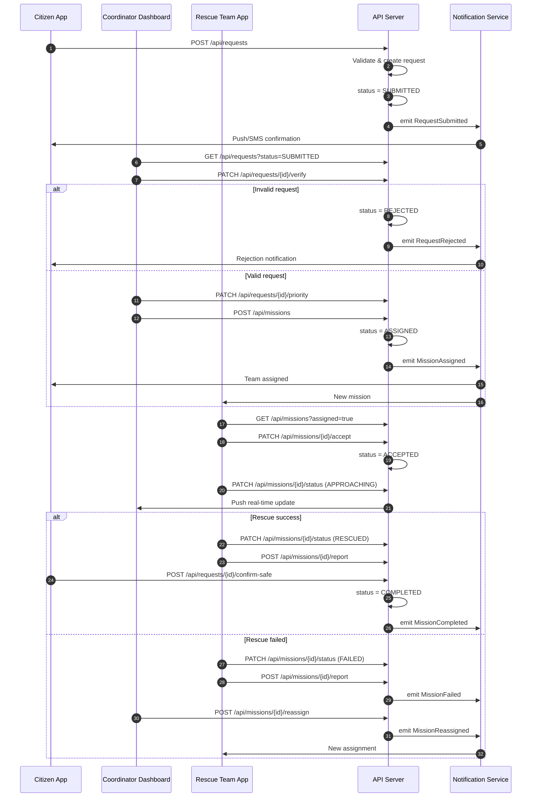

```mermaid
sequenceDiagram
    autonumber

    participant CitizenApp as Citizen App
    participant CoordinatorUI as Coordinator Dashboard
    participant TeamApp as Rescue Team App
    participant API as API Server
    participant Noti as Notification Service

    %% --- Submit Rescue Request ---
    CitizenApp ->> API: POST /api/requests
    API ->> API: Validate & create request
    API ->> API: status = SUBMITTED
    API ->> Noti: emit RequestSubmitted
    Noti ->> CitizenApp: Push/SMS confirmation

    %% --- Coordinator verifies request ---
    CoordinatorUI ->> API: GET /api/requests?status=SUBMITTED
    CoordinatorUI ->> API: PATCH /api/requests/{id}/verify

    alt Invalid request
        API ->> API: status = REJECTED
        API ->> Noti: emit RequestRejected
        Noti ->> CitizenApp: Rejection notification
    else Valid request
        CoordinatorUI ->> API: PATCH /api/requests/{id}/priority
        CoordinatorUI ->> API: POST /api/missions
        API ->> API: status = ASSIGNED
        API ->> Noti: emit MissionAssigned
        Noti ->> CitizenApp: Team assigned
        Noti ->> TeamApp: New mission
    end

    %% --- Rescue team execution ---
    TeamApp ->> API: GET /api/missions?assigned=true
    TeamApp ->> API: PATCH /api/missions/{id}/accept
    API ->> API: status = ACCEPTED

    TeamApp ->> API: PATCH /api/missions/{id}/status (APPROACHING)
    API ->> CoordinatorUI: Push real-time update

    %% --- Mission outcome ---
    alt Rescue success
        TeamApp ->> API: PATCH /api/missions/{id}/status (RESCUED)
        TeamApp ->> API: POST /api/missions/{id}/report
        CitizenApp ->> API: POST /api/requests/{id}/confirm-safe
        API ->> API: status = COMPLETED
        API ->> Noti: emit MissionCompleted
    else Rescue failed
        TeamApp ->> API: PATCH /api/missions/{id}/status (FAILED)
        TeamApp ->> API: POST /api/missions/{id}/report
        API ->> Noti: emit MissionFailed

        CoordinatorUI ->> API: POST /api/missions/{id}/reassign
        API ->> Noti: emit MissionReassigned
        Noti ->> TeamApp: New assignment
    end
```