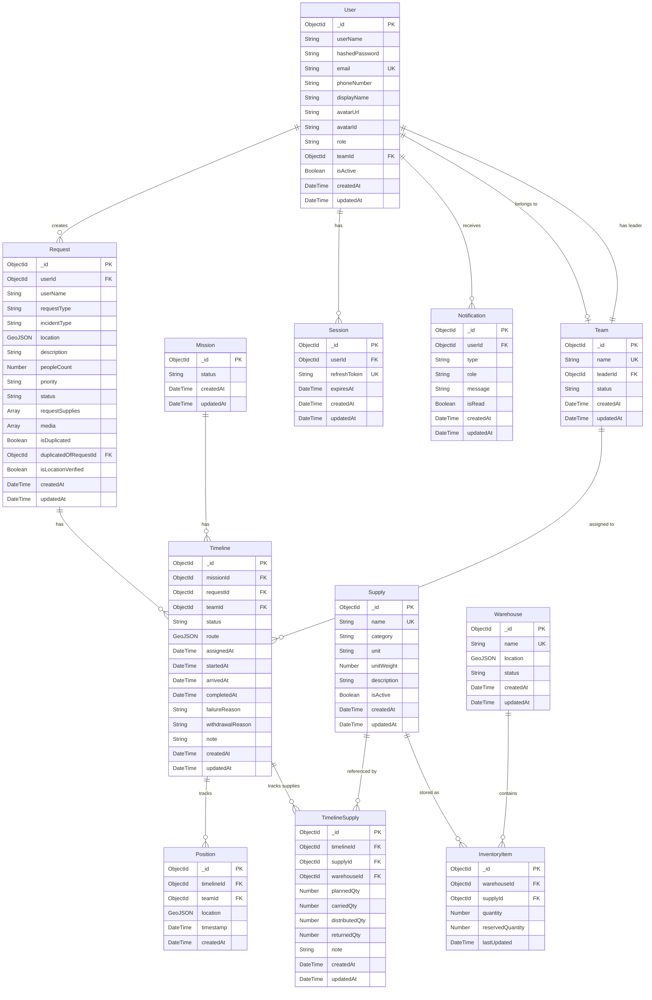

# Entity Relationship Diagram

> Mô hình dữ liệu cho hệ thống Flood Rescue

---

## ERD Diagram

---

## Entity Definitions

### Core Entities

#### User

Người dùng hệ thống với các roles: Citizen, Rescue Team, Coordinator, Admin, Manager.

| Field            | Type      | Description                                       |
| ---------------- | --------- | ------------------------------------------------- |
| `_id`            | ObjectId  | Primary key                                       |
| `userName`       | String    | Username đăng nhập                                |
| `email`          | String    | Email (unique)                                    |
| `hashedPassword` | String    | Mật khẩu đã hash                                  |
| `phoneNumber`    | String    | Số điện thoại (sparse unique)                     |
| `displayName`    | String    | Tên hiển thị                                      |
| `avatarUrl`      | String    | Link CDN avatar                                   |
| `role`           | Enum      | Citizen, Rescue Team, Coordinator, Admin, Manager |
| `teamId`         | ObjectId? | FK → Team (nullable, chỉ cho Rescue Team)         |
| `isActive`       | Boolean   | Trạng thái tài khoản                              |

---

#### Team

Đội cứu hộ. Mỗi User chỉ thuộc 1 Team tại 1 thời điểm.

| Field      | Type     | Description             |
| ---------- | -------- | ----------------------- |
| `_id`      | ObjectId | Primary key             |
| `name`     | String   | Tên team (unique)       |
| `leaderId` | ObjectId | FK → User (team leader) |
| `status`   | Enum     | AVAILABLE, BUSY         |

> [!NOTE]
> [!IMPORTANT]
> **Team Capacity:** Một Rescue Team chỉ được xử lý **1 nhiệm vụ (Timeline)** tại một thời điểm. Trạng thái Team sẽ chuyển sang `BUSY` khi nhận nhiệm vụ và về `AVAILABLE` khi hoàn thành.

---

#### Request

Yêu cầu cứu hộ từ Citizen.

| Field                   | Type          | Description                                                      |
| ----------------------- | ------------- | ---------------------------------------------------------------- |
| `_id`                   | ObjectId      | Primary key                                                      |
| `userId`                | ObjectId      | FK → User (Citizen hoặc Coordinator nếu tạo thay mặt)            |
| `userName`              | String        | Tên người gửi                                                    |
| `requestType`           | Enum          | Rescue, Relief                                                   |
| `incidentType`          | Enum          | Flood, Trapped, Injured, Landslide, Other                        |
| `location`              | GeoJSON Point | `{ type: "Point", coordinates: [lng, lat] }`                     |
| `description`           | String        | Mô tả tình huống                                                 |
| `peopleCount`           | Number        | Số người cần cứu (1-100)                                         |
| `priority`              | Enum          | Critical, High, Normal                                           |
| `status`                | Enum          | Submitted, Accepted, Rejected, In Progress, Completed, Cancelled |
| `requestSupplies`       | Array         | `[{ supplyId: ObjectId, requestedQty: Number }]` - Supplies cần  |
| `media`                 | String[]      | Danh sách URL hình ảnh                                           |
| `isDuplicated`          | Boolean       | Coordinator đánh dấu nếu request trùng (default: false)          |
| `duplicatedOfRequestId` | ObjectId?     | FK → Request (request gốc nếu là duplicate)                      |
| `isLocationVerified`    | Boolean       | Coordinator verify location chính xác (default: false)           |

**Business Rules:**

> [!IMPORTANT]
> **Request Limit:** Một Citizen chỉ được tạo Request mới khi request hiện tại đã ở terminal states (`CLOSED` hoặc `CANCELLED`). Hệ thống validate và reject request mới nếu vi phạm.

> [!NOTE]
> **Priority Assignment:** Priority flag được Coordinator gắn thủ công khi verify request. Thứ tự ưu tiên xử lý:
>
> 1. Mức độ khẩn cấp (priority)
> 2. Số người bị ảnh hưởng (peopleCount)
> 3. Thời gian tạo (createdAt)

> [!NOTE]
> **Duplicate Detection:** Coordinator đánh dấu duplicate thủ công (`isDuplicated = true`). Request duplicate vẫn được verify và có status giống request chính. _Future enhancement: Hệ thống đề xuất duplicate dựa trên location + time + citizen._

> [!NOTE]
> **On Behalf Creation:** Coordinator có thể tạo Request thay mặt Citizen. Request này có `userId` của Coordinator và flow verify giống Request thường.

---

#### Mission

Nhiệm vụ cứu hộ được tạo bởi Coordinator.

| Field    | Type     | Description                                               |
| -------- | -------- | --------------------------------------------------------- |
| `_id`    | ObjectId | Primary key                                               |
| `status` | Enum     | PLANNED, IN_PROGRESS, PAUSED, PARTIAL, COMPLETED, ABORTED |

---

#### Timeline

Associative entity giữa Mission, Request và Team. Đại diện cho **một lần thực thi cứu hộ**.

| Field              | Type               | Description                                               |
| ------------------ | ------------------ | --------------------------------------------------------- |
| `_id`              | ObjectId           | Primary key                                               |
| `missionId`        | ObjectId           | FK → Mission                                              |
| `requestId`        | ObjectId           | FK → Request                                              |
| `teamId`           | ObjectId           | FK → Team                                                 |
| `status`           | Enum               | ASSIGNED, EN_ROUTE, ARRIVED, COMPLETED, FAILED, WITHDRAWN |
| `route`            | GeoJSON LineString | Đường đi tổng hợp của team                                |
| `assignedAt`       | DateTime           | Thời điểm assign                                          |
| `startedAt`        | DateTime           | Thời điểm team accept (EN_ROUTE)                          |
| `arrivedAt`        | DateTime           | Thời điểm team đến nơi (ARRIVED)                          |
| `completedAt`      | DateTime           | Thời điểm hoàn thành/thất bại                             |
| `failureReason`    | String?            | Lý do thất bại                                            |
| `withdrawalReason` | String?            | Lý do rút/từ chối                                         |
| `note`             | String?            | Ghi chú                                                   |

---

#### Position

Vị trí theo thời gian thực của Team trong quá trình thực hiện Timeline.

| Field        | Type          | Description                                  |
| ------------ | ------------- | -------------------------------------------- |
| `_id`        | ObjectId      | Primary key                                  |
| `timelineId` | ObjectId      | FK → Timeline                                |
| `teamId`     | ObjectId      | FK → Team                                    |
| `location`   | GeoJSON Point | `{ type: "Point", coordinates: [lng, lat] }` |
| `timestamp`  | DateTime      | Thời điểm ghi nhận                           |

**Tracking rules:**

- Ghi nhận mỗi **30 giây** khi Timeline ở trạng thái `EN_ROUTE` hoặc `ARRIVED`
- **Retention**: 60 ngày (sử dụng MongoDB TTL index)

---

### Supply Management Entities

#### Supply

Danh mục supplies chuẩn của hệ thống.

| Field         | Type     | Description                                      |
| ------------- | -------- | ------------------------------------------------ |
| `_id`         | ObjectId | Primary key                                      |
| `name`        | String   | Tên supply (unique)                              |
| `category`    | Enum     | FOOD, WATER, MEDICAL, CLOTHING, EQUIPMENT, OTHER |
| `unit`        | String   | Đơn vị tính (chai, thùng, kg, cái...)            |
| `unitWeight`  | Number?  | Trọng lượng/đơn vị (kg)                          |
| `description` | String   | Mô tả                                            |
| `isActive`    | Boolean  | Còn sử dụng không                                |

---

#### Warehouse

Kho hàng cứu trợ.

| Field      | Type          | Description      |
| ---------- | ------------- | ---------------- |
| `_id`      | ObjectId      | Primary key      |
| `name`     | String        | Tên kho (unique) |
| `location` | GeoJSON Point | Vị trí kho       |
| `status`   | Enum          | ACTIVE, INACTIVE |

---

#### InventoryItem

Tồn kho của từng supply tại warehouse.

| Field              | Type     | Description                |
| ------------------ | -------- | -------------------------- |
| `_id`              | ObjectId | Primary key                |
| `warehouseId`      | ObjectId | FK → Warehouse             |
| `supplyId`         | ObjectId | FK → Supply                |
| `quantity`         | Number   | Số lượng hiện có           |
| `reservedQuantity` | Number   | Số lượng đã đặt (chờ xuất) |
| `lastUpdated`      | DateTime | Lần cập nhật cuối          |

> **Available = quantity - reservedQuantity**

---

#### TimelineSupply

Tracking supplies cho mỗi Timeline qua 3 giai đoạn.

| Field            | Type     | Description                               |
| ---------------- | -------- | ----------------------------------------- |
| `_id`            | ObjectId | Primary key                               |
| `timelineId`     | ObjectId | FK → Timeline                             |
| `supplyId`       | ObjectId | FK → Supply                               |
| `warehouseId`    | ObjectId | FK → Warehouse (nguồn xuất)               |
| `plannedQty`     | Number   | Số lượng dự định (Coordinator plan)       |
| `carriedQty`     | Number   | Số lượng thực tế mang theo (Team confirm) |
| `distributedQty` | Number   | Số lượng đã phát/sử dụng (Team report)    |
| `returnedQty`    | Number   | Số lượng trả về kho                       |
| `note`           | String?  | Ghi chú                                   |

---

### Supporting Entities

#### Session

Phiên đăng nhập của User.

| Field          | Type     | Description                   |
| -------------- | -------- | ----------------------------- |
| `_id`          | ObjectId | Primary key                   |
| `userId`       | ObjectId | FK → User                     |
| `refreshToken` | String   | Refresh token (unique)        |
| `expiresAt`    | DateTime | Thời điểm hết hạn (TTL index) |

---

#### Notification

Thông báo hệ thống.

| Field     | Type     | Description                                                      |
| --------- | -------- | ---------------------------------------------------------------- |
| `_id`     | ObjectId | Primary key                                                      |
| `userId`  | ObjectId | FK → User                                                        |
| `type`    | Enum     | SUBMITTED, ACCEPTED, REJECTED, IN_PROGRESS, COMPLETED, CANCELLED |
| `role`    | Enum     | CITIZEN, COORDINATOR, TEAM_LEADER, ADMIN, MANAGER                |
| `message` | String   | Nội dung thông báo                                               |
| `isRead`  | Boolean  | Đã đọc chưa                                                      |

---

## Relationships Summary

| Relationship              | Cardinality | Description                               |
| ------------------------- | ----------- | ----------------------------------------- |
| User → Team               | N:1         | User thuộc 0-1 team                       |
| Team → User (leader)      | 1:1         | Team có 1 leader                          |
| User → Request            | 1:N         | Citizen tạo nhiều requests                |
| Request → Timeline        | 1:N         | Request có nhiều timelines (reassignment) |
| Mission → Timeline        | 1:N         | Mission có nhiều timelines                |
| Team → Timeline           | 1:N         | Team được assign nhiều timelines          |
| Timeline → Position       | 1:N         | Timeline có nhiều positions               |
| Timeline → TimelineSupply | 1:N         | Timeline có nhiều supplies được track     |
| Supply → TimelineSupply   | 1:N         | Supply được track trong nhiều timelines   |
| Supply → InventoryItem    | 1:N         | Supply có inventory tại nhiều warehouses  |
| Warehouse → InventoryItem | 1:N         | Warehouse chứa nhiều inventory items      |
| User → Session            | 1:N         | User có nhiều sessions                    |
| User → Notification       | 1:N         | User nhận nhiều notifications             |

---

## References

- [Rescue_flow_2.1.md](./Rescue_flow_2.1.md) - Flow diagrams
- [rules.md](./rules.md) - Derive rules for statuses
