# 🗺️ Sitemap — Flood Rescue & Relief System

> **Version:** 1.1 — URLs không chứa role name. Route groups `(citizen)`, `(coordinator)`... chỉ dùng để tổ chức code.
>
> Dựa trên [Rescue Flow 2.2](./Flows/Rescue_flow_2.2.md), [Relief Flow 1.1](./Flows/Relief_flow_1.1.md), [ERD](./SRS/ERD.md), [TodoList FE](./Todos/TodoList_FE.md).

---

## Visual Sitemap

```mermaid
flowchart TD
    ROOT["/"]

    ROOT --> AUTH["🔐 (auth)"]
    ROOT --> PUBLIC["🌐 (public)"]
    ROOT --> CITIZEN["🏠 (citizen)"]
    ROOT --> COORD["📋 (coordinator)"]
    ROOT --> TEAM["🚒 (team)"]
    ROOT --> MANAGER["📦 (manager)"]
    ROOT --> ADMIN["⚙️ (admin)"]

    AUTH --> LOGIN["/login"]
    AUTH --> REGISTER["/register"]
    AUTH --> FORGOT["/forgot-password"]
    AUTH --> RESET["/reset-password"]

    PUBLIC --> LANDING["/ (landing)"]
    PUBLIC --> SAFETY["/safety-guide"]

    CITIZEN --> C_HOME["/home"]
    C_HOME --> C_SOS["/sos"]
    C_HOME --> C_HIST["/my-requests"]
    C_HIST --> C_DETAIL["/my-requests/:id"]
    C_HOME --> C_NOTI["/notifications"]
    C_HOME --> C_PROF["/profile"]

    COORD --> CO_DASH["/dashboard"]
    CO_DASH --> CO_REQ["/requests"]
    CO_REQ --> CO_REQD["/requests/:id"]
    CO_DASH --> CO_MIS["/missions"]
    CO_MIS --> CO_MISD["/missions/:id"]
    CO_DASH --> CO_TEAM["/teams"]
    CO_TEAM --> CO_TEAMD["/teams/:id"]
    CO_DASH --> CO_MAP["/operations"]

    TEAM --> T_DASH["/my-missions"]
    T_DASH --> T_MISD["/my-missions/:id"]
    T_DASH --> T_NAV["/navigation"]

    MANAGER --> M_DASH["/supplies"]
    M_DASH --> M_WH["/warehouses"]
    M_WH --> M_WHD["/warehouses/:id"]
    M_DASH --> M_INV["/inventory"]

    ADMIN --> A_DASH["/users"]
    A_DASH --> A_USERD["/users/:id"]
    A_DASH --> A_SYS["/settings"]
    A_DASH --> A_REP["/reports"]
```



---

## Detailed Route Table

### 🔐 `(auth)` — Chưa đăng nhập

| URL                | Page            | Mô tả                                  |
| :----------------- | :-------------- | :------------------------------------- |
| `/login`           | Login           | Đăng nhập email + password             |
| `/register`        | Register        | Đăng ký Citizen (bắt buộc phoneNumber) |
| `/forgot-password` | Forgot Password | Nhập email nhận link reset             |
| `/reset-password`  | Reset Password  | Đặt lại mật khẩu                       |

---

### 🌐 `(public)` — Không cần đăng nhập

| URL             | Page         | Mô tả                                          |
| :-------------- | :----------- | :--------------------------------------------- |
| `/`             | Landing Page | Giới thiệu hệ thống, điều hướng login/register |
| `/safety-guide` | Safety Guide | Hướng dẫn an toàn mùa lũ                       |

---

### 🏠 `(citizen)` — Citizen

> Layout mobile-first, bottom navigation.

| URL                | Page            | Features                                                                       |
| :----------------- | :-------------- | :----------------------------------------------------------------------------- |
| `/home`            | Dashboard       | Tổng quan request hiện tại, trạng thái, nút SOS                                |
| `/sos`             | Create Request  | Form: loại (Rescue/Relief), mô tả, location, ảnh, số người, supplies           |
| `/my-requests`     | Request History | Danh sách requests đã gửi, filter theo status                                  |
| `/my-requests/:id` | Request Detail  | Chi tiết: status request, vị trí bản thân và Team trên map (khi `IN_PROGRESS`) |
| `/notifications`   | Notifications   | Request verified, team assigned, team arrived...                               |
| `/profile`         | Profile         | Edit displayName, phoneNumber, avatar, đổi password                            |

**UX Flow:** `Home → [SOS] → Create Request → My Requests → Detail`

---

### 📋 `(coordinator)` — Coordinator

> Layout desktop sidebar.

| URL             | Page               | Features                                                                                       |
| :-------------- | :----------------- | :--------------------------------------------------------------------------------------------- |
| `/dashboard`    | Dashboard          | Requests pending, missions active, teams available, quick stats                                |
| `/requests`     | Request Management | Tất cả requests. Filter: status, priority, type, source                                        |
| `/requests/:id` | Request Detail     | Actions: Verify/Reject, Update location, Mark duplicate, Set priority, Create on-behalf, Close |
| `/missions`     | Mission Management | Danh sách missions. Filter: status, type. Actions: Create, Pause, Resume, Abort                |
| `/missions/:id` | Mission Detail     | Timelines, teams, request info. Actions: Assign team, Pause/Resume/Abort                       |
| `/teams`        | Team Overview      | Danh sách teams: status, members, leader. CRUD                                                 |
| `/teams/:id`    | Team Detail        | Thành viên, change leader, add/remove members                                                  |
| `/operations`   | Operations Map     | Bản đồ tổng quan: requests cluster, team positions, mission routes                             |

**UX Flow:**

```
Dashboard → Requests (SUBMITTED) → Verify → Create Mission → Assign Team → Monitor
Dashboard → Teams → Manage
Dashboard → Operations → Giám sát
```

#### Key Actions — Request Detail:

| Action           | Rule                                           |
| :--------------- | :--------------------------------------------- |
| Verify / Reject  | `SUBMITTED` → `VERIFIED` / `REJECTED`          |
| Set Priority     | Chỉ `VERIFIED`: `CRITICAL` / `HIGH` / `NORMAL` |
| Update Location  | Chỉnh tọa độ + `isLocationVerified = true`     |
| Mark Duplicate   | Link với request gốc, sync status & priority   |
| Create On-Behalf | Tạo thay citizen, auto `VERIFIED`              |
| Close            | `FULFILLED` → `CLOSED`                         |

---

### 🚒 `(team)` — Rescue Team

> Layout mobile/tablet, bottom nav hoặc sidebar.

| URL                | Page           | Features                                                   |
| :----------------- | :------------- | :--------------------------------------------------------- |
| `/my-missions`     | Mission List   | Danh sách missions được assign, filter by status           |
| `/my-missions/:id` | Mission Detail | Timeline actions: Accept, Arrive, Complete, Fail, Withdraw |
| `/navigation`      | GPS Navigation | Route đến location, gửi GPS position mỗi 30s               |

#### Timeline Actions:

| Action   | Transition                        | Mô tả                                  |
| :------- | :-------------------------------- | :------------------------------------- |
| Accept   | `ASSIGNED` → `EN_ROUTE`           | Chấp nhận, confirm supply `carriedQty` |
| Arrive   | `EN_ROUTE` → `ON_SITE`            | Đến nơi, bắt đầu cứu hộ/phát đồ        |
| Complete | `ON_SITE` → `COMPLETED`/`PARTIAL` | Báo cáo: rescued count, supply         |
| Fail     | `ON_SITE` → `FAILED`              | Ghi reason                             |
| Withdraw | `ASSIGNED` → `WITHDRAWN`          | Từ chối, ghi reason                    |

---

### 📦 `(manager)` — Manager

> Layout desktop sidebar.

| URL               | Page               | Features                                                   |
| :---------------- | :----------------- | :--------------------------------------------------------- |
| `/supplies`       | Supply Catalog     | CRUD: tên, category (Food/Water/Medical/...), unit, weight |
| `/warehouses`     | Warehouse List     | Danh sách kho: tên, location, status (Active/Inactive)     |
| `/warehouses/:id` | Warehouse Detail   | Inventory items, stock levels, restock                     |
| `/inventory`      | Inventory Overview | Tổng hợp tồn kho: available = quantity − reserved          |

---

### ⚙️ `(admin)` — Admin

> Layout desktop sidebar.

| URL          | Page             | Features                                                                 |
| :----------- | :--------------- | :----------------------------------------------------------------------- |
| `/users`     | User Management  | Danh sách users, filter by role/status. Change role, activate/deactivate |
| `/users/:id` | User Detail      | Thông tin, role, activity history                                        |
| `/settings`  | System Settings  | Categories, incident types, auto-close rules                             |
| `/reports`   | Reports & Export | Báo cáo tổng hợp, export CSV                                             |

---

## Access Control Matrix

| Page            | Citizen | Team | Coordinator | Manager | Admin |
| :-------------- | :-----: | :--: | :---------: | :-----: | :---: |
| `(auth)`        |   ✅    |  ✅  |     ✅      |   ✅    |  ✅   |
| `(public)`      |   ✅    |  ✅  |     ✅      |   ✅    |  ✅   |
| `(citizen)`     |   ✅    |  ❌  |     ❌      |   ❌    |  ❌   |
| `(coordinator)` |   ❌    |  ❌  |     ✅      |   ❌    |  ✅   |
| `(team)`        |   ❌    |  ✅  |     ❌      |   ❌    |  ❌   |
| `(manager)`     |   ❌    |  ❌  |     ❌      |   ✅    |  ✅   |
| `(admin)`       |   ❌    |  ❌  |     ❌      |   ❌    |  ✅   |

---

## Route Grouping — Next.js App Router

```
src/app/
├── (auth)/                       # Không sidebar
│   ├── login/page.tsx
│   ├── register/page.tsx
│   ├── forgot-password/page.tsx
│   └── reset-password/page.tsx
│
├── (public)/                     # Layout public
│   ├── page.tsx                  # Landing  → /
│   └── safety-guide/page.tsx     #          → /safety-guide
│
├── (citizen)/                    # Bottom nav mobile
│   ├── layout.tsx
│   ├── home/page.tsx             #          → /home
│   ├── map/page.tsx              #          → /map
│   ├── sos/page.tsx              #          → /sos
│   ├── my-requests/
│   │   ├── page.tsx              #          → /my-requests
│   │   └── [id]/page.tsx         #          → /my-requests/:id
│   ├── track/[id]/page.tsx       #          → /track/:id
│   ├── notifications/page.tsx    #          → /notifications
│   └── profile/page.tsx          #          → /profile
│
├── (coordinator)/                # Sidebar desktop
│   ├── layout.tsx
│   ├── dashboard/page.tsx        #          → /dashboard
│   ├── requests/
│   │   ├── page.tsx              #          → /requests
│   │   └── [id]/page.tsx         #          → /requests/:id
│   ├── missions/
│   │   ├── page.tsx              #          → /missions
│   │   └── [id]/page.tsx         #          → /missions/:id
│   ├── teams/
│   │   ├── page.tsx              #          → /teams
│   │   └── [id]/page.tsx         #          → /teams/:id
│   └── operations/page.tsx       #          → /operations
│
├── (team)/                       # Bottom nav / sidebar
│   ├── layout.tsx
│   ├── my-missions/
│   │   ├── page.tsx              #          → /my-missions
│   │   └── [id]/page.tsx         #          → /my-missions/:id
│   └── navigation/page.tsx       #          → /navigation
│
├── (manager)/                    # Sidebar desktop
│   ├── layout.tsx
│   ├── supplies/page.tsx         #          → /supplies
│   ├── warehouses/
│   │   ├── page.tsx              #          → /warehouses
│   │   └── [id]/page.tsx         #          → /warehouses/:id
│   └── inventory/page.tsx        #          → /inventory
│
└── (admin)/                      # Sidebar desktop
    ├── layout.tsx
    ├── users/
    │   ├── page.tsx              #          → /users
    │   └── [id]/page.tsx         #          → /users/:id
    ├── settings/page.tsx         #          → /settings
    └── reports/page.tsx          #          → /reports
```

---

## Implementation Priority

| Priority  | Routes                                                                                             | Phase        |
| :-------- | :------------------------------------------------------------------------------------------------- | :----------- |
| **P0 ✅** | `/login`, `/register`, `/home`, `/sos`, `/my-requests`, `/notifications`, `/profile`               | Phase 1 Done |
| **P1 🚧** | `/dashboard`, `/requests`, `/requests/:id`, `/missions`, `/missions/:id`, `/teams`, `/my-missions` | Phase 1      |
| **P2**    | `/operations`, `/my-missions/:id` (actions), `/track/:id`, `/navigation`                           | Phase 1–3    |
| **P3**    | `/supplies`, `/warehouses`, `/inventory`                                                           | Phase 2      |
| **P4**    | `/users`, `/settings`, `/reports`                                                                  | Phase 4      |

---

## References

- [Rescue Flow 2.2](./Flows/Rescue_flow_2.2.md) · [Relief Flow 1.1](./Flows/Relief_flow_1.1.md)
- [ERD](./SRS/ERD.md) · [Rules](./SRS/rules.md)
- [TodoList FE](./Todos/TodoList_FE.md) · [TodoList BE](./Todos/TodoList_BE.md)
