# 🗺️ Sitemap - FPT Flood Rescue & Relief System

## 📊 Mermaid Sitemap Overview

```mermaid
flowchart TD

ROOT["/"]

ROOT --> PUBLIC["(public)"]
ROOT --> CITIZEN["(citizen)"]
ROOT --> TEAM["(team)"]
ROOT --> COORD["(coordinator)"]
ROOT --> MANAGER["(manager)"]
ROOT --> ADMIN["(admin)"]

%% ---------------- PUBLIC ----------------
PUBLIC --> HOME["/"]
PUBLIC --> LOGIN["/login"]
PUBLIC --> REGISTER["/register"]
PUBLIC --> FORGOT["/forgot-password"]
PUBLIC --> RESET["/reset-password"]

%% ---------------- CITIZEN ----------------
CITIZEN --> C_DASH["/dashboard"]
CITIZEN --> C_NEW["/request/new"]
CITIZEN --> C_DETAIL["/request/:id"]
CITIZEN --> C_NOTI["/notifications"]
CITIZEN --> C_PROFILE["/profile"]
CITIZEN --> C_HELP["/help"]

C_NEW --> STEP1["location"]
C_NEW --> STEP2["incident"]
C_NEW --> STEP3["details"]
C_NEW --> STEP4["supplies"]
C_NEW --> STEP5["review"]

C_DETAIL --> TRACK["tracking"]
C_DETAIL --> TIMELINE["timeline"]
C_DETAIL --> MEDIA["media"]

%% ---------------- TEAM ----------------
TEAM --> T_MISSIONS["/missions"]
TEAM --> T_DETAIL["/mission/:timelineId"]
TEAM --> T_NOTI["/notifications"]
TEAM --> T_PROFILE["/team-profile"]
TEAM --> T_SETTINGS["/settings"]

T_MISSIONS --> T_ASSIGNED["assigned"]
T_MISSIONS --> T_PROGRESS["in-progress"]
T_MISSIONS --> T_HISTORY["history"]

T_DETAIL --> T_MAP["map"]
T_DETAIL --> T_REPORT["report"]
T_DETAIL --> T_ROUTE["route-log"]

%% ---------------- COORDINATOR ----------------
COORD --> CO_DASH["/dashboard"]
COORD --> CO_REQUESTS["/requests"]
COORD --> CO_REQ_DETAIL["/request/:id"]
COORD --> CO_MISSIONS["/missions"]
COORD --> CO_TEAMS["/teams"]
COORD --> CO_ANALYTICS["/analytics"]
COORD --> CO_NOTI["/notifications"]

CO_REQUESTS --> SUBMITTED["submitted"]
CO_REQUESTS --> ACCEPTED["accepted"]
CO_REQUESTS --> INPROG["in-progress"]
CO_REQUESTS --> HISTORY2["history"]

CO_REQ_DETAIL --> ASSIGN["assign"]
CO_REQ_DETAIL --> TL_HISTORY["timeline-history"]
CO_REQ_DETAIL --> LOGS["logs"]

CO_MISSIONS --> ACTIVE["active"]
CO_MISSIONS --> PAUSED["paused"]
CO_MISSIONS --> COMPLETED["completed"]

CO_TEAMS --> AVAIL["availability"]
CO_TEAMS --> PERF["performance"]

%% ---------------- MANAGER ----------------
MANAGER --> M_DASH["/dashboard"]
MANAGER --> M_RES["/resources"]
MANAGER --> M_INV["/inventory"]
MANAGER --> M_HUB["/relief-hubs"]
MANAGER --> M_DIST["/distribution"]
MANAGER --> M_REPORT["/reports"]

M_RES --> VEH["vehicles"]
M_RES --> EQUIP["equipment"]

M_INV --> STOCK["stock-overview"]
M_INV --> MOVE["movements"]
M_INV --> DIST_REC["distribution-records"]

%% ---------------- ADMIN ----------------
ADMIN --> A_DASH["/dashboard"]
ADMIN --> A_USERS["/users"]
ADMIN --> A_ROLES["/roles-permissions"]
ADMIN --> A_CAT["/categories"]
ADMIN --> A_SYS["/system-config"]
ADMIN --> A_LOG["/audit-logs"]
ADMIN --> A_REPORT["/reports"]

A_USERS --> U_CIT["citizens"]
A_USERS --> U_TEAM["teams"]
A_USERS --> U_COORD["coordinators"]
A_USERS --> U_MGR["managers"]

A_CAT --> CAT_INC["incident-types"]
A_CAT --> CAT_REQ["request-types"]
A_CAT --> CAT_PRI["priority-levels"]
A_CAT --> CAT_SUP["supply-types"]

```



---

## 🏗️ CẤU TRÚC TỔNG THỂ

```
app/
│
├── (public)/        → Public routes (landing, auth)
├── (citizen)/       → Citizen portal
├── (team)/          → Team portal
├── (coordinator)/   → Coordinator portal
├── (manager)/       → Manager portal
└── (admin)/         → Admin portal
```

> **Note:** Route groups `()` KHÔNG xuất hiện trên URL.

---

## 🌍 PUBLIC ROUTES

### Folder Structure
```
(public)
│
├── page.tsx                    → "/"
├── login/page.tsx              → "/login"
├── register/page.tsx           → "/register"
├── forgot-password/page.tsx    → "/forgot-password"
└── reset-password/page.tsx     → "/reset-password"
```

### Routes
| Route                | Description              |
|----------------------|--------------------------|
| `/`                  | Landing page             |
| `/login`             | Login page               |
| `/register`          | Registration page        |
| `/forgot-password`   | Forgot password page     |
| `/reset-password`    | Reset password page      |

---

## 👤 CITIZEN SITE MAP

### URL Structure
```
/
├── dashboard
├── request/new
├── request/[id]
├── notifications
├── profile
└── help
```

### Folder Structure
```
(citizen)
│
├── layout.tsx
│
├── dashboard/
│   └── page.tsx
│
├── request/
│   ├── new/
│   │   ├── page.tsx
│   │   ├── location/
│   │   ├── incident/
│   │   ├── details/
│   │   ├── supplies/
│   │   └── review/
│   │
│   └── [id]/
│       ├── page.tsx
│       ├── tracking/
│       ├── timeline/
│       └── media/
│
├── notifications/
│   └── page.tsx
│
├── profile/
│   └── page.tsx
│
└── help/
    └── page.tsx
```

### Navigation Model
**Top Navigation:**
- Dashboard
- My Request
- Notifications
- Profile

### Key Features
- Submit rescue/relief requests
- Track request status in real-time
- View notifications and updates
- Manage personal profile

---

## 🚑 TEAM SITE MAP

### URL Structure
```
/
├── missions
├── mission/[timelineId]
├── notifications
├── team-profile
└── settings
```

### Folder Structure
```
(team)
│
├── layout.tsx
│
├── missions/
│   ├── page.tsx
│   ├── assigned/
│   ├── in-progress/
│   └── history/
│
├── mission/
│   └── [timelineId]/
│       ├── page.tsx
│       ├── map/
│       ├── report/
│       └── route-log/
│
├── notifications/
│   └── page.tsx
│
├── team-profile/
│   └── page.tsx
│
└── settings/
    └── page.tsx
```

### Navigation Model
**Mobile-first Bottom Navigation:**
- Missions
- Map (current mission)
- Notifications
- Profile

### Key Features
- View assigned missions
- Track mission progress with real-time map
- Submit mission reports
- View route logs and history

---

## 🎯 COORDINATOR SITE MAP (Core System)

### URL Structure
```
/
├── dashboard
├── requests
├── request/[id]
├── missions
├── teams
├── analytics
└── notifications
```

### Folder Structure
```
(coordinator)
│
├── layout.tsx
│
├── dashboard/
│   └── page.tsx
│
├── requests/
│   ├── page.tsx
│   ├── submitted/
│   ├── accepted/
│   ├── in-progress/
│   └── history/
│
├── request/
│   └── [id]/
│       ├── page.tsx
│       ├── assign/
│       ├── timeline-history/
│       └── logs/
│
├── missions/
│   ├── page.tsx
│   ├── active/
│   ├── paused/
│   └── completed/
│
├── teams/
│   ├── page.tsx
│   ├── availability/
│   └── performance/
│
├── analytics/
│   └── page.tsx
│
└── notifications/
    └── page.tsx
```

### Dashboard Layout (3-Panel Design)

| Left Panel        | Center Panel              | Right Panel         |
|-------------------|---------------------------|---------------------|
| Request Queue     | Master Map (OpenStreetMap)| Team Availability   |

### Key Features
- Manage incoming rescue/relief requests
- Assign missions to available teams
- Monitor all missions on master map
- Track team performance and availability
- View analytics and reports

---

## 📦 MANAGER SITE MAP

### URL Structure
```
/
├── dashboard
├── resources
├── inventory
├── relief-hubs
├── distribution
└── reports
```

### Folder Structure
```
(manager)
│
├── layout.tsx
│
├── dashboard/
│   └── page.tsx
│
├── resources/
│   ├── vehicles/
│   └── equipment/
│
├── inventory/
│   ├── page.tsx
│   ├── stock-overview/
│   ├── movements/
│   └── distribution-records/
│
├── relief-hubs/
│   └── page.tsx
│
├── distribution/
│   └── page.tsx
│
└── reports/
    └── page.tsx
```

### Key Features
- Manage resources (vehicles, equipment)
- Track inventory and supplies
- Monitor relief hubs
- Manage distribution operations
- Generate resource reports

---

## ⚙️ ADMIN SITE MAP

### URL Structure
```
/
├── dashboard
├── users
├── roles
├── categories
├── system-config
├── audit-logs
└── reports
```

### Folder Structure
```
(admin)
│
├── layout.tsx
│
├── dashboard/
│   └── page.tsx
│
├── users/
│   ├── citizens/
│   ├── teams/
│   ├── coordinators/
│   └── managers/
│
├── roles-permissions/
│   └── page.tsx
│
├── categories/
│   ├── incident-types/
│   ├── request-types/
│   ├── priority-levels/
│   └── supply-types/
│
├── system-config/
│   └── page.tsx
│
├── audit-logs/
│   └── page.tsx
│
└── reports/
    └── page.tsx
```

### Key Features
- Manage all users (CRUD operations)
- Configure roles and permissions
- Manage system categories
- System configuration and settings
- View audit logs and system reports

---

## 🧠 Route Guard Strategy

### Middleware Logic

| Route Group      | Required Role   | Redirect on Fail |
|------------------|-----------------|------------------|
| `/(citizen)`     | `CITIZEN`       | `/login`         |
| `/(team)`        | `TEAM`          | `/login`         |
| `/(coordinator)` | `COORDINATOR`   | `/login`         |
| `/(manager)`     | `MANAGER`       | `/login`         |
| `/(admin)`       | `ADMIN`         | `/login`         |

```typescript
// Middleware example
if (path.startsWith('/citizen') && role !== 'CITIZEN') {
  return redirect('/login')
}
```

---

## 🧩 Shared Structure (Outside Route Groups)

```
src/
│
├── components/       → Reusable UI components
├── modules/          → Feature modules (DDD structure)
├── lib/              → Utility libraries
├── hooks/            → Custom React hooks
├── types/            → TypeScript type definitions
├── constants/        → Application constants
└── services/         → API services and clients
```

### Shared Components
- **AuthGuard:** Role-based route protection
- **AuthInitializer:** Authentication initialization
- **ErrorBoundary:** Error handling
- **Layout components:** Sidebar, Header, Footer
- **Form components:** Input, Select, Button, etc.

---

## 📝 Notes

1. **Route Groups `()`** are used for organization only and do not appear in URLs
2. **Dynamic Routes `[id]`** are used for detailed pages
3. **Nested Routes** follow Next.js 13+ App Router conventions
4. **Authentication** is handled via middleware and AuthGuard
5. **State Management** uses Zustand stores
6. **API Calls** are centralized in service modules
