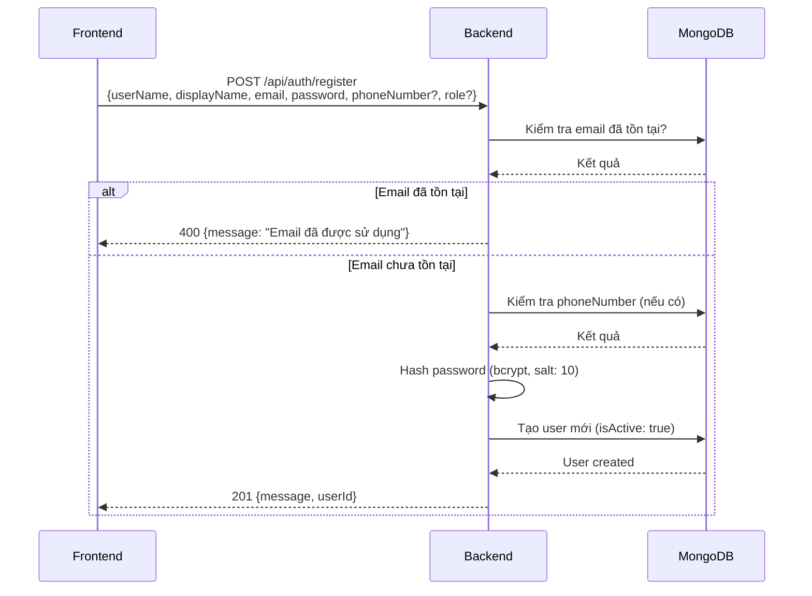
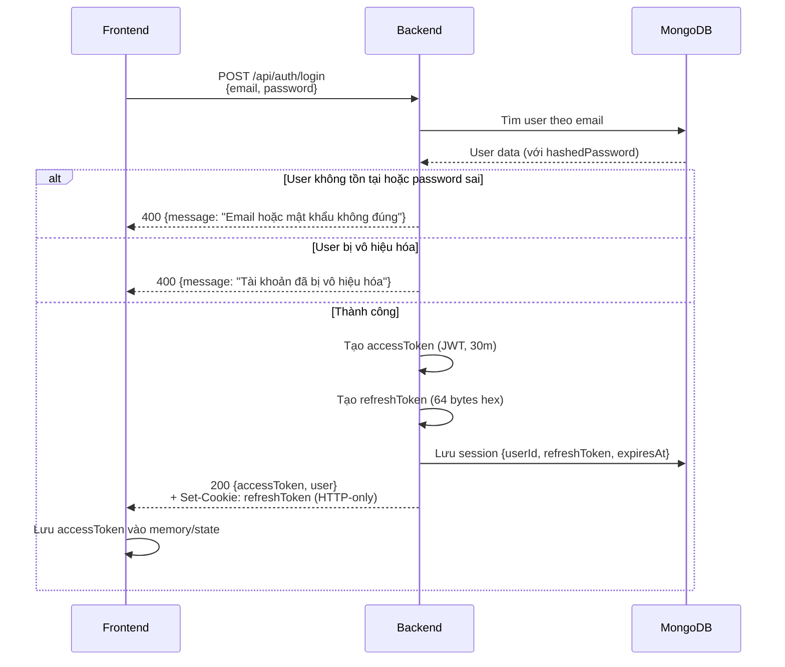
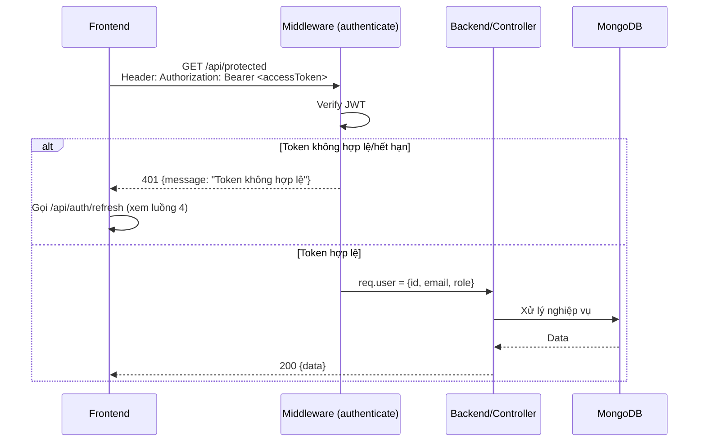
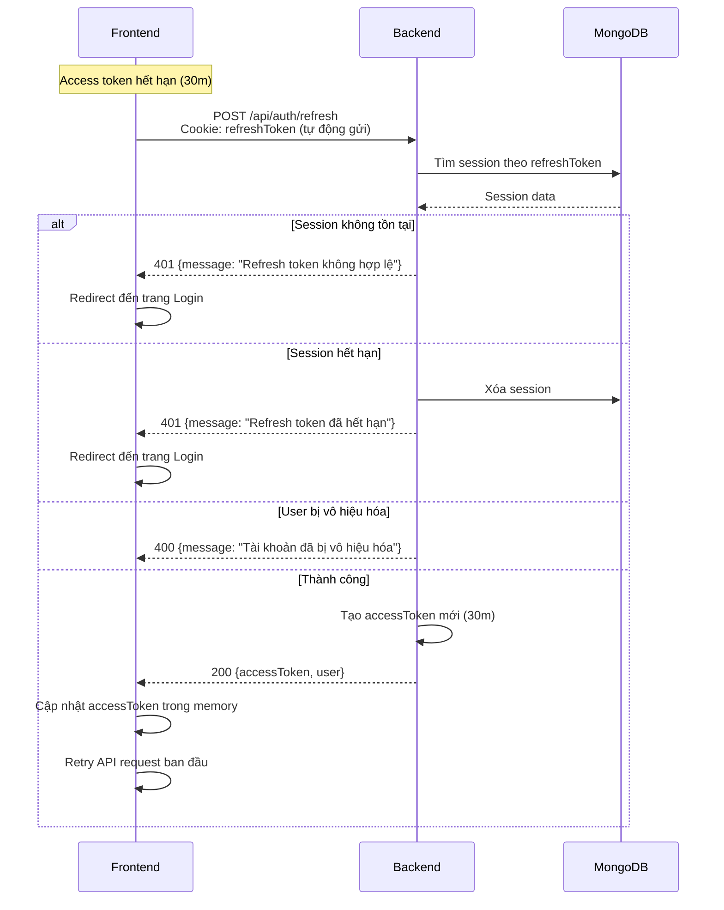
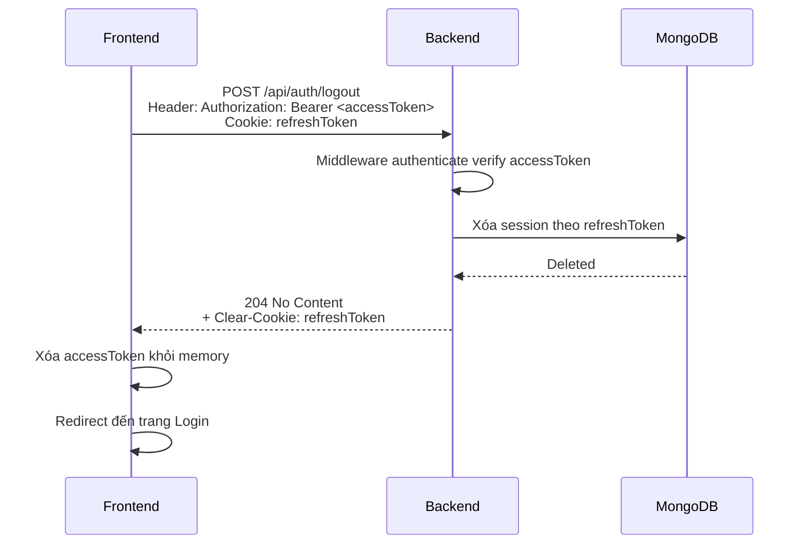

# Luồng xác thực (JWT)

## 📊 Sơ đồ luồng Auth

### 1. Luồng Đăng ký (Register)


### 2. Luồng Đăng nhập (Login)


### 3. Luồng Gọi API Protected


### 4. Luồng Refresh Token


### 5. Luồng Đăng xuất (Logout)


### 6. Tổng quan luồng hoàn chỉnh
```mermaid
flowchart TD
    subgraph Client [Frontend]
        A[Trang Login] --> B{Đăng nhập}
        B -->|Thành công| C[Lưu accessToken vào memory]
        C --> D[Gọi API Protected]
        D --> E{Token hết hạn?}
        E -->|Không| F[Nhận response]
        E -->|Có| G[Gọi /refresh]
        G -->|Thành công| H[Cập nhật accessToken]
        H --> D
        G -->|Thất bại| A
        F --> I{Logout?}
        I -->|Có| J[Gọi /logout]
        J --> A
    end
    
    subgraph Server [Backend]
        K[/api/auth/login] --> L[Verify credentials]
        L --> M[Tạo tokens]
        M --> N[Lưu session vào DB]
        
        O[/api/auth/refresh] --> P[Đọc cookie refreshToken]
        P --> Q[Kiểm tra session]
        Q --> R[Tạo accessToken mới]
        
        S[/api/auth/logout] --> T[Xóa session]
        T --> U[Clear cookie]
    end
    
    C -.->|accessToken trong Header| D
    B -.->|POST credentials| K
    G -.->|Cookie tự gửi| O
    J -.->|accessToken + Cookie| S
```

---

## 1) Thành phần chính
- **Access token**: JWT (HS256) chứa `user.id`, `user.email`, `user.role`, hết hạn 30m.
- **Refresh token**: Chuỗi ngẫu nhiên 128 hex (64 bytes), lưu trong collection `sessions` (MongoDB) kèm `userId`, `expiresAt` (7 ngày), unique.
- **Cookie**: `refreshToken` được set HTTP-only, SameSite=Strict, Secure (prod), Max-Age 7 ngày.
- **Middleware**: `authenticate` đọc `Authorization: Bearer <accessToken>` và verify JWT.

## 2) Luồng endpoint
- **POST /api/auth/register**:
  1) Nhận `userName`, `displayName`, `email`, `password`, `phoneNumber` (optional), `role` (optional, default: "Citizen").
  2) Kiểm tra email và phoneNumber (nếu có) đã tồn tại chưa.
  3) Hash password với bcrypt (salt rounds: 10).
  4) Tạo user mới với `isActive: true`.
  5) Trả về `{ message, userId }`.
- **POST /api/auth/login**:
  1) Verify email/password, kiểm tra user active.
  2) Tạo `accessToken` (30m) + `refreshToken` (7d), lưu refresh vào DB (sessions).
  3) Trả `accessToken` + `user` trong body, set cookie `refreshToken` HTTP-only.
- **POST /api/auth/refresh**:
  1) Lấy `refreshToken` từ cookie.
  2) Tra cứu session theo refreshToken, kiểm tra hết hạn và user còn active.
  3) Trả `accessToken` mới + `user` trong body. (Không rotate refresh token theo yêu cầu hiện tại.)
- **GET /api/auth/me**: Yêu cầu header `Authorization: Bearer <accessToken>`, trả thông tin user hiện tại.
- **POST /api/auth/logout**:
  1) Yêu cầu access token (middleware authenticate) và cookie refreshToken.
  2) Xóa session theo refreshToken, clear cookie.

## 3) Lưu ý bảo mật
- Refresh token chỉ ở cookie HTTP-only, tránh lưu trong localStorage.
- SameSite=Strict để giảm CSRF; trong production bật `secure`.
- Không gửi refresh token trong body hay header cho các route khác.
- Access token ngắn (30m) để giảm rủi ro lộ token.

## 4) Mô hình dữ liệu
- **sessions**: `{ userId: ObjectId, refreshToken: string, expiresAt: Date, createdAt, updatedAt }` + index TTL trên `expiresAt`.

## 5) Trình tự thông điệp (tóm tắt)
1. Client login → nhận `accessToken` (body) + `refreshToken` (cookie).
2. Client gọi API protected kèm `Authorization: Bearer <accessToken>`.
3. Khi access token hết hạn → gọi **POST /api/auth/refresh** (cookie tự gửi) → nhận access token mới.
4. Logout → access token trong header + refresh token cookie → server xóa session, clear cookie.
